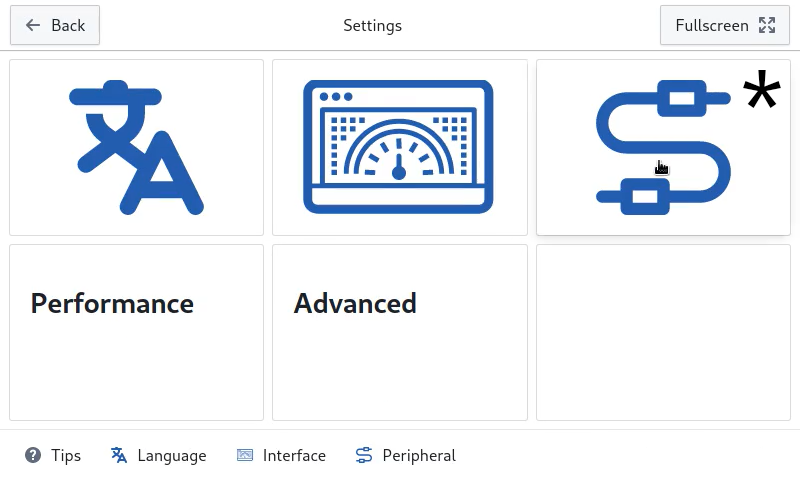
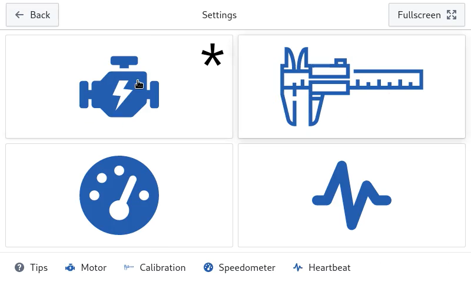
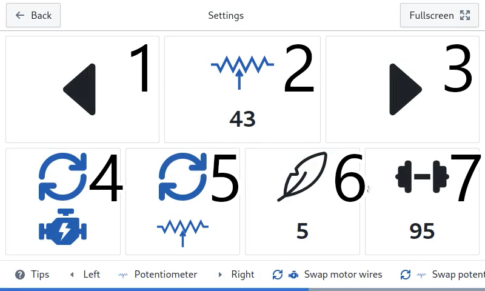

| English | [Русский](README.ru.md) | [YouTube Demo](https://www.youtube.com/watch?v=wF2pY8McmVg) | [Live Web Demo](https://custom-trainer.onrender.com) |
| ------- | ----------------------- | ----------------------------------------------------------- | ---------------------------------------------------- |

# Custom Trainer

This app is designed for Raspberry Pi 3 Model B+ (or better). It is designed to upgrade an existing (or build a new) elliptical (or bike) trainer.

### History

The control board on my elliptical trainer broke. I wanted to buy a more modern model, but almost all modern trainers have limited functionality and allow you to do heavy workouts only after paying a monthly subscription. I decided to create my own trainer control board using RPI. In this way I will solve the problem and gain experience with GPIO and creating applications for Ubuntu.
The application was written for the ProForm PFEL59260 trainer and tested on it. Perhaps your model may differ to it, study the connection scheme and compare with your trainer before starting or configuring anything.

### Prepare Raspberry Pi

#### 1. Install Raspberry Pi OS (64-bit)

Open [this link](https://www.raspberrypi.com/software/operating-systems/#raspberry-pi-os-64-bit "Raspberry Pi OS (64-bit)") and follow instruction. It is important to install exactly the 64-bit version of the system, because there is a high probability that problems will arise when working on the 32-bit version.

#### 2. Enable SPI interface

Official manual [here](https://www.raspberrypi.com/documentation/computers/raspberry-pi.html#driver). Another one manual [here](https://www.raspberrypi-spy.co.uk/2014/08/enabling-the-spi-interface-on-the-raspberry-pi/) (Step 1 & Step 2).

#### 3. Conncect trainer

According [scheme](other/scheme.png) connect GPIO to periphery of trainer. You wil need:

- microchip MCP3008
- board HW-095

#### 4. Install app

Go to "[Releases](https://github.com/modox94/Custom-Trainer/releases)" and download latest version `.deb` file. Copy it to RPI. [Manual](https://www.freecodecamp.org/news/scp-linux-command-example-how-to-ssh-file-transfer-from-remote-to-local/) for ssh copy, or you can copy by usb stick.  
Install package. There is [manual](https://help.ubuntu.com/kubuntu/desktopguide/C/manual-install.html).

### Settings and usage

Start app.
Go to settings page.

<table>
  <tr>
    <td width="40%"> Go to settings </td>
    <td width="60%">
      
    </td>
  </tr>
  <tr>
    <td width="40%"> Then periphery </td>
    <td width="60%">
      
    </td>
  </tr>
  <tr>
    <td width="40%"> Then motor </td>
    <td width="60%">
      
    </td>
  </tr>
  <tr>
    <td width="40%">
      <ol>
        <li>Step to "left"</li>
        <li>Potentiometer readings</li>
        <li>Step to "right"</li>
        <li>Swap motor wires</li>
        <li>Swap potentiometer wires</li>
        <li>Easiest position</li>
        <li>Hardest position</li>
      </ol>
    </td>
    <td width="60%">
      
    </td>
  </tr>
</table>

Set the potentiometer values for the edge (easiest **[6]** and hardest **[7]**) resistance level. When pressed to the left button **[1]** - the value of the potentiometer **[2]** should decrease, to the right button **[3]** - increase. If necessary, you can reverse the potentiometer **[5]** or motor direction **[4]**.

I recommend watching a recording of the setup process in [this](https://www.youtube.com/watch?v=wF2pY8McmVg) video.

In the future, this manual and the application will be improved as far as possible. If you want to make changes or have questions, you can text me at [telegram](https://t.me/crazynike94).

The application actually does not require a lot of resources and would probably work fine even on RPI1, however I could not compile the application for the 32 bit version of the software. If someone can help to do this, then it will be possible to greatly reduce the cost of upgrading the trainer.
