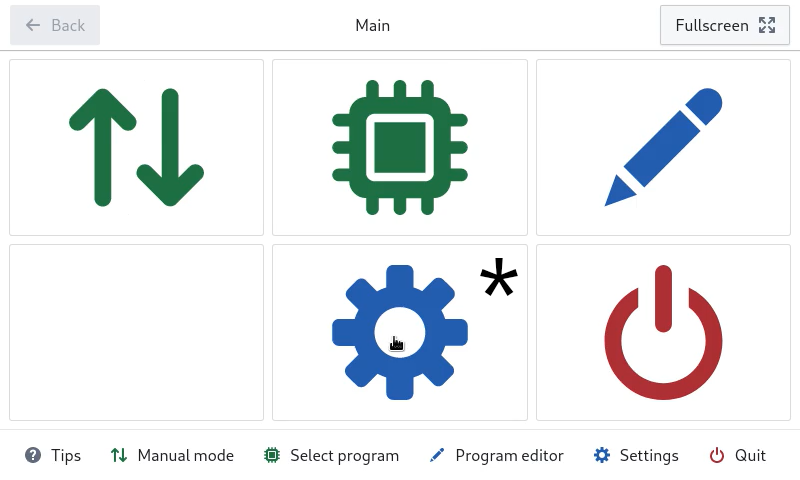
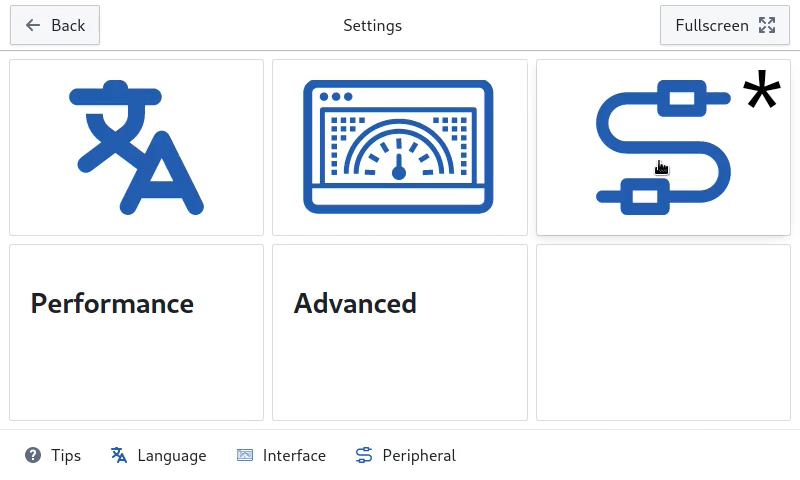
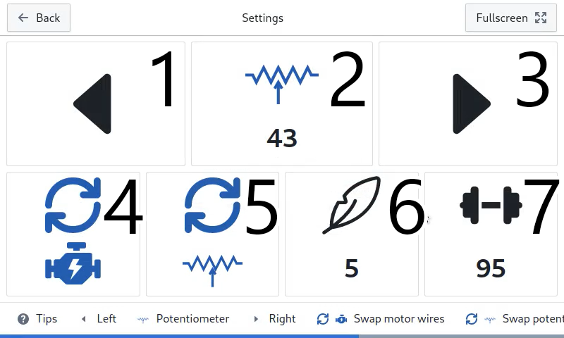

| [English](README.md) | Русский | [YouTube Demo](https://www.youtube.com/watch?v=wF2pY8McmVg) | [Live Web Demo](https://custom-trainer.onrender.com) |
| -------------------- | ------- | ----------------------------------------------------------- | ---------------------------------------------------- |

# Custom Trainer

Это приложение создано для Raspberry Pi 3 Model B+ (или выше) и предназначено для модернизации существующего (или создания нового) эллиптического (или вело) тренажера.

### История

На моем тренажере сломалась управляющая плата. Я хотел купить более современную модель, но выяснилось, что почти все современные тренажеры имеют умышленно ограниченный функционал и дают возможность запускать тяжелые тренировки только после оплаты ежемесячной подписки. Поэтому я пришел к выводу, что лучше будет создать собственное управление тренажером с помощью RPI. Таким образом я решу проблему и получу опыт работы с GPIO и создания приложений для Ubuntu.
Приложение писалось для тренажера ProForm PFEL59260 и испытывалось на нем. Возможно ваша модель может отличаться в той или иной степени, изучите схему подключения и сравните со своим аппаратом прежде, чем что-то запускать или настраивать.

### Подготовка Raspberry Pi

#### 1. Установка Raspberry Pi OS (64-bit)

Пройдите по [этой ссылке](https://www.raspberrypi.com/software/operating-systems/#raspberry-pi-os-64-bit "Raspberry Pi OS (64-bit)") и следуйте инструкции. Важно установить именно 64-bit версию системы, т.к. высока вероятность, что при работе на 32-bit версии возникнут проблемы.

#### 2. Включение интерфейса SPI

После установки Raspberry Pi OS и настройки нужно включить интерфейс SPI. Официальная документация [тут](https://www.raspberrypi.com/documentation/computers/raspberry-pi.html#driver). Еще одна инструкция есть [здесь](https://www.raspberrypi-spy.co.uk/2014/08/enabling-the-spi-interface-on-the-raspberry-pi/) (Step 1 & Step 2).

#### 3. Подключаем тренажер

Согласно [схеме](other/scheme.png) подключаем выводы GPIO к периферии. Вам потребуется купить:

- микросхему MCP3008
- плату HW-095

#### 4. Установка приложения

Переходим в раздел "[Releases](https://github.com/modox94/Custom-Trainer/releases)" и скачиваем последнюю версию приложения, файл с расширением `.deb`. Копируем его на устройство. Вот [инструкция](https://www.freecodecamp.org/news/scp-linux-command-example-how-to-ssh-file-transfer-from-remote-to-local/) для копирования по локальной сети, также можно просто скачать на флешку и подключить к RPI.  
Далее устанавливаем пакет. Вот [инструкция](https://help.ubuntu.com/kubuntu/desktopguide/C/manual-install.html).

### Настройка и использование

Запустите приложение.  
Перейдите в раздел настроек двигателя.

<table>
  <tr>
    <td width="40%"> Перейдите в настройки </td>
    <td width="60%">
      
    </td>
  </tr>
  <tr>
    <td width="40%"> Откройте периферию </td>
    <td width="60%">
      
    </td>
  </tr>
  <tr>
    <td width="40%"> Далее двигатель </td>
    <td width="60%">
      
    </td>
  </tr>
  <tr>
    <td width="40%">
      <ol>
        <li>Шаг "влево"</li>
        <li>Показания потенциометра</li>
        <li>Шаг "вправо"</li>
        <li>Поменять местами провода двигателя</li>
        <li>Поменять местами провода потенциометра</li>
        <li>Легчайшее положение</li>
        <li>Тяжелейшее положение</li>
      </ol>
    </td>
    <td width="60%">
      
    </td>
  </tr>
</table>

Задайте значения потенциометра для крайних (самого легкого **[6]** и тяжелого **[7]**) положений нагрузки. Значение легкой нагрузки должно быть численно **[2]** меньше тяжелой. При нажатии влево **[1]** - значение потенциометра **[2]** должно уменьшаться, вправо **[3]** - увеличиваться. При необходимости вы можете обратить показания потенциометра **[5]** или направления двигателя **[4]**.

Рекомендуется посмотреть запись процесса настройки в [этом](https://www.youtube.com/watch?v=wF2pY8McmVg) ролике.

В дальнейшем эта инструкция будет дополнятся по мере возможности, а приложение совершенствоваться. Если вы хотите внести изменения, дополнения или у вас есть вопросы вы можете написать мне в [telegram](https://t.me/crazynike94).

Приложение фактически не требует большого количества ресурсов и вероятно нормально работала бы даже на RPI1, однако я не смог скомпилировать приложение для 32 битной версии ПО. Если кто-то сможет помочь это сделать, то можно будет сильно удешевить модернизацию тренажера.
